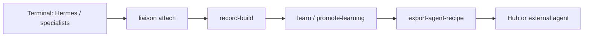

# Build corpus and custom coding agents

Liaison already records agent work through the **reporter lifecycle** (outbox, approvals, learnings, events). This track adds a **build corpus** layer so you can review how slices were built and **export a recipe** for your own hub agent, Cursor agent, or external runner — without a fine-tuning pipeline.

## What already records build behavior

| Mechanism | Where | What it captures |
|-----------|--------|------------------|
| **attach / outbox** | `.spark-flow/tasks/<id>/outbox/*.md` | Agent reports with metadata (agent, title, time) |
| **approve / rejected** | `approved/`, `APPROVALS.md` | Governed promotion of reports |
| **HANDOFFS.md** | Task root | Attach audit trail |
| **events.jsonl** | Task root | JSONL: attach, validate, close-task, record-build, … |
| **LEARNINGS.md** + **promote-learning** | Task → `$LIAISON_ROOT/memory/*.learning.md` | Durable lessons |
| **CLOSEOUT.md** | Task root | Slice summary after `close-task` |
| **Flywheel / evaluations** | `OBSERVATIONS.md`, `EVALUATIONS.md`, `TRACEABILITY_REPORT.md` | Data-flywheel and eval loops |
| **Terminal sessions** | `memory/terminal_sessions.json` | Which agent pane was spawned |
| **Patterns** | `BRIEF.md` (from `start-pattern`) | Multi-agent chain and steps |
| **Portfolio plan** | `registry/project_plans.yaml`, `plan-project` | Workflow, pattern, gates (does not replace corpus) |
| **registry/agents.yaml** | Hub | Launch hints and contracts |

**Gap (before this slice):** no single artifact that says *how Hermes (or others) built the code* in operator-distilled steps, and no one-shot **export** that merges traces + learnings + pattern into a reusable **agent recipe**.

## New artifacts and commands

| Piece | Purpose |
|-------|---------|
| `templates/BUILD_TRACE.md` | Per-task structured build log |
| `liaison record-build` | Append a build step to the current task |
| `templates/AGENT_RECIPE.md` | Export template for recipes |
| `liaison export-agent-recipe --from-project <key>` | Aggregate corpus → recipe markdown |
| `liaison export-learning-bridge --from-project <key>` | Append promoted learnings digest to repo `.spark-flow/memory/hermes_hints.md` |
| `registry/agent_recipes.yaml` + `registry/recipes/*.md` | Index and stored exports |
| Command-center JSON `build_corpus_summary` | Counts when a project is focused |

### Record a Hermes slice

```bash
cd /path/to/your/repo
liaison init hermes-slice-1 "Vertical slice: API endpoint"
liaison start-pattern hermes-led-slice --task-id hermes-slice-1
# Terminal: run Hermes, implement, produce report.md
liaison attach hermes --file report.md --title "Hermes slice report"
liaison approve-artifact <outbox-artifact.md>
liaison validate --profile python

# Distill how the agent built (operator or post-hoc)
liaison record-build --agent hermes --action "Implemented POST /widgets" --outcome "Tests green; PR #12"
liaison record-build --agent hermes --action "Wired validation profile" --outcome "checks/backend.sh pass"

liaison close-task --summary "Slice shipped"
liaison learn "Prefer smallest API surface before UI"
liaison promote-learning --tags "myproject,hermes"
liaison export-learning-bridge --from-project myproject
```

`export-learning-bridge` copies matching `memory/*.learning.md` entries (by project tag or filename) into the repo as an **append-only** `hermes_hints.md` digest. It does **not** mutate Hermes skill files — operator-visible artifact only.

### Export a recipe for your own agent

```bash
liaison export-agent-recipe --from-project sigma --write --show
# Writes: registry/recipes/sigma-hermes-led-slice-YYYYMMDD.md
# Updates: registry/agent_recipes.yaml index
```

Use the markdown as:

- A **skill pack** skeleton (copy sections into `skills/<your-agent>/SKILL.md`)
- A **launch recipe** (chain, attach loop, validation profile)
- Prompt context for an **external** coding agent (paste `BUILD_STEPS` + `LEARNINGS`)

### Dashboard

With a focused project (`?project=sigma`), JSON includes `build_corpus_summary`: task count, build steps recorded, exported recipes, and copy-paste CLI hints.

## Workflow: record → review → export → run



1. **Record** — Normal reporter path plus optional `record-build` after meaningful steps (not every keystroke).
2. **Review** — `BUILD_TRACE.md`, outbox, `LEARNINGS.md`, command center handoffs.
3. **Export** — `export-agent-recipe --write` when a slice or project milestone is stable.
4. **Run** — New task with `start-pattern` from recipe, or register a custom hub entry pointing at the exported markdown.

## Integration with portfolio planning

`plan-project` / `project_plans.yaml` define **intent, workflow, pattern, and gates**. The build corpus **does not** replace them. Export reads the registry plan for `workflow`, `pattern`, and `validation_profile` when present; otherwise it infers pattern from task `BRIEF.md` files.

## Out of scope

- ML fine-tuning or dataset pipelines
- A new long-running “coding agent” daemon
- Automatic transcript ingestion from IDE (use `attach` and `record-build` deliberately)

## See also

- [command_reference.md](command_reference.md) — full CLI table
- [integrated-operator-model.md](integrated-operator-model.md) — terminals vs dashboard
- [operator-upgrades-roadmap.md](operator-upgrades-roadmap.md) — operator UX track
