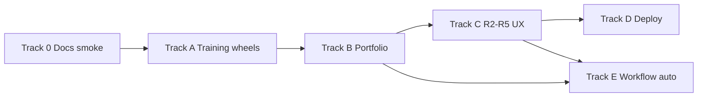

# Finish-line backlog

**Canonical planning source** for P3b, R2–R6, portfolio operations, doc hygiene, and training wheels (hooks + automations). Parent roadmaps: [operator-upgrades-roadmap.md](../operator-upgrades-roadmap.md) (A–H, P1–P3), [command-center-upgrade-roadmap.md](../command-center-upgrade-roadmap.md) (R1–R6).

**Scope:** “Finish” = operator can run multi-project HITL on Spark (tmux + Liaison + dashboard/TUI) with predictable data on disk, optional remote dashboard, and no critical doc/UX lies.

**Out of scope:** Live agent streaming in the UI, full Cursor-as-translator replacement, Hermes direct skill mutation (use `export-learning-bridge`).

**Related docs:** [execution-bridge.md](../execution-bridge.md) · [dashboard-web-deploy.md](../dashboard-web-deploy.md) · [operator-training-wheels.md](../operator-training-wheels.md) · [operator-closeout-checklist.md](../operator-closeout-checklist.md) (A.3–A.5 + B.5) · [tier-c-playbook.md](../tier-c-playbook.md)

---

## Tracks

| Track | Focus | File |
|-------|--------|------|
| **0** | Doc & SSOT hygiene | [track-0-doc-ssot.md](track-0-doc-ssot.md) |
| **A** | Training wheels (hooks, digest, smoke) | [track-a-training-wheels.md](track-a-training-wheels.md) |
| **B** | Portfolio & walkthrough readiness | [track-b-portfolio.md](track-b-portfolio.md) |
| **C** | Command center depth (R2–R5) | [track-c-command-center.md](track-c-command-center.md) |
| **D** | Production & hosting (P3b deploy + R6) | [track-d-production.md](track-d-production.md) |
| **E** | Workflow automation (phased) | [track-e-workflow-auto.md](track-e-workflow-auto.md) |
| **F** | Non-goals / parking lot | [track-f-non-goals.md](track-f-non-goals.md) |

**Recommended execution order:** Track 0 → Track A → Track B (sprints 1–3) → choose Track C *or* Track D → Track E as capacity allows.

---

## How to read tickets

| Field | Meaning |
|--------|---------|
| **ID** | Stable ticket id |
| **Size** | S (<1 day) · M (2–4 days) · L (1–2 weeks) · XL (multi-sprint) |
| **Deps** | Must ship before |
| **Done when** | Acceptance criteria |
| **Status** | Shipped in tree when marked **Done** |

---

## Recommended program plan (6–8 weeks shape)

| Week | Focus | Exit criterion |
|------|--------|----------------|
| 1 | 0.1–0.4, A.1–A.3, A.6, B.1 | Docs truthful; hooks + digest; sigma smoke green |
| 2 | A.4 (UI), B.5 (human), C1 done | C1.1–C1.4 shipped; Sprint C2 (matrix preview, BuildCorpus) next |
| 3 | C1.3–C1.4, C2.1–C2.3 | Hub graph + workstream depth |
| 4 | C3.1–C3.4, 0.3 | Ops polish + TUI action picker |
| 5 | D.1 + D.2a (**Done**) | ADR + same-host prod script; D.2b deferred |
| 6 | D.3, D.5 (**Done**), C3.5 (optional) | CI runs JSON smoke + vitest; TUI 3-col if terminal ops daily |
| 7+ | E0 → E1 | Guarded workflow steps only if audit demands automation |

---

## Definition of done (whole program)

1. **Disk truth:** Every executor session on Tier A walkthrough repos can end with `observe-session complete` and visible kanban/outcome.
2. **Surfaces aligned:** Web + TUI gate strip + phase controls match JSON; quick-ref current.
3. **Portfolio:** Tier A repos bootstrapped; Tier C playbook exists; two-project walkthrough signed off.
4. **Hosting:** ADR + one deployed dashboard path (even if read-only Vercel + local tmux).
5. **Training wheels:** Hooks nudge complete; optional automation digest.
6. **Backlog honest:** R2–R6 and P3b statuses updated; execution-bridge deferred section fixed.

---

## If you only have capacity for one track next

| Priority if you care about… | Start with |
|-----------------------------|------------|
| **Daily ops on DGX** | [Track A](track-a-training-wheels.md) + [B.1](track-b-portfolio.md) + A.6 |
| **Dashboard polish** | [Track C](track-c-command-center.md) (C1.1 → C1.2 → C2) |
| **Remote visibility** | [Track D](track-d-production.md) (D.1 → D.2a or D.2b) |
| **Less copy-paste** | [Track E0](track-e-workflow-auto.md) after B.4 (do not jump to E2) |
