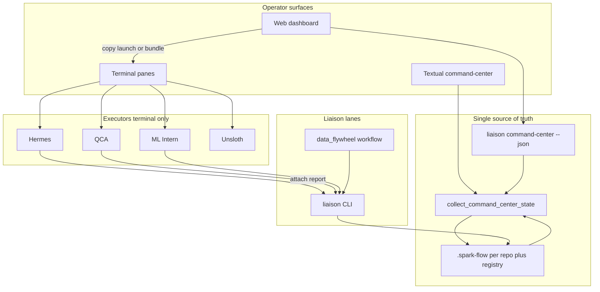
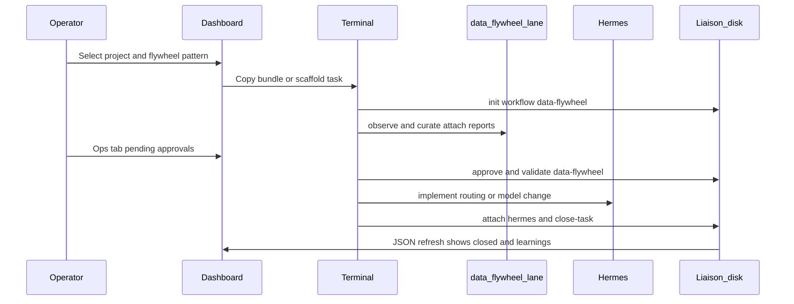

# Integrated operator model

Liaison coordinates hub agents, registered projects, and the closed feedback loop through **one filesystem**, **one JSON aggregate**, and **three operator surfaces**. This document is the canonical description of how those pieces fit together for day-to-day work.

**Related docs**

| Topic | Location |
|-------|----------|
| CLI commands | [command_reference.md](command_reference.md) |
| Reporter lifecycle | [operating_model.md](operating_model.md) |
| Control-plane layers | [architecture.md](architecture.md) |
| Closed feedback policy | [../policies/closed-feedback-policy.md](../policies/closed-feedback-policy.md) |
| Data flywheel policy | [../policies/data-flywheel-policy.md](../policies/data-flywheel-policy.md) |
| Upgrade checklist (A–H) | [operator-upgrades-roadmap.md](operator-upgrades-roadmap.md) |
| One-page operator cheat sheet | [operator-quick-reference.md](operator-quick-reference.md) |
| Web + TUI setup | [../dashboard/README.md](../dashboard/README.md) |
| Spark-local liaison guides (outside repo) | [spark-local-guides.md](spark-local-guides.md) |

---

## One sentence model

**Hermes and specialists execute in the terminal; Liaison governs on disk; the web dashboard and Textual TUI mirror the same JSON state.** They orient you, copy the next command, and show inbox and gates. They do not replace the terminal where agents stream output.

`data_flywheel` is a **Liaison lane** (workflow plus attach target), not a separate daemon beside Hermes.

**Execution bridge** ([execution-bridge.md](execution-bridge.md)) closes the gap between pane A (executors) and pane B (governance): venture-bound `terminal-session` / `observe-session complete` writes observations, events, and on failure evaluations + learnings into the active task without Cursor as translator. Workstation capacity and `venture-queue` scope multi-project work.

---

## One system, three surfaces

| Surface | Entry | Role |
|---------|-------|------|
| **Web** | `dashboard/web` — `npm run dev` | Portfolio layout, gate strip, hub operator deck, pattern scaffold, reporter checklist, copy helpers |
| **TUI** | `liaison command-center` (alias `liaison tui`) | Dense keyboard cockpit: rolodex, hub, workstream kanban, ops metrics; allowlisted read-only runs |
| **Terminal** | User panes (tmux, wezterm, IDE) | Run `hermes`, `qca`, `ml-intern`, etc.; run `liaison init`, `attach`, `approve`, `validate`, `close-task` |

All read-only UI surfaces consume **`liaison command-center --json`**, which calls `collect_command_center_state()` in `dashboard/command_center/data.py`. Runtime truth remains under each repo’s `.spark-flow/` and in `registry/`.



### Refresh rule

Anything that changes disk (`attach`, `approve`, `close-task`, `start-pattern`) should appear in JSON after `liaison look --refresh`, a dashboard **Refresh data** action (`?refresh=1`), or the next SWR poll. The browser must not duplicate agent runtime state; it reflects files and aggregates only.

Web polling uses **stale-while-revalidate** (`keepPreviousData` in `CommandCenterContext`) so a refresh does not blank the whole layout.

---

## Closed feedback loop

Policy: [closed-feedback-policy.md](../policies/closed-feedback-policy.md). Evaluation contract: [../evaluations/closed-feedback-loop.yaml](../evaluations/closed-feedback-loop.yaml).

```text
objective → context → reasoning/handoff → action/report → observation → evaluation → learning → improvement → updated knowledge
```

| Loop stage | Liaison artifact / command |
|------------|---------------------------|
| Objective | `init`, `OBJECTIVES.md`, `BRIEF.md` |
| Context | `snapshot`, `CONTEXT.md`, project memory |
| Action / report | Agent work in **terminal** → `attach <agent>` → `outbox/` |
| Governance | `approve-artifact`, `DECISIONS.md`, `HANDOFFS.md` |
| Observation | `observe`, logs, flywheel traffic windows |
| Evaluation | `evaluate`, `score-artifacts`, `validate`, `gate` |
| Learning | `learn`, `promote-learning`, hub memory |
| Close | `close-task`, `CLOSEOUT.md`, phase advance |

The **dashboard** reflects the middle and tail of the loop (tasks, handoffs, debriefs, blockers). The **terminal** owns the action/report step where humans watch agents work.

Reporter-mode practice (Spark docs): see [spark-local-guides.md](spark-local-guides.md#reporter-mode).

---

## Hub groups

Hub agents are grouped consistently on the web hub (`dashboard/web/src/lib/hub-agent-groups.ts`) and in [registry/agents.yaml](../registry/agents.yaml) launch notes.

| Group | Agents | Where they run | What flows back to Liaison |
|-------|--------|----------------|----------------------------|
| **Executors** | hermes, qca, ml_intern, unsloth_studio | Dedicated terminal panes | `liaison attach <agent>` → outbox → approve → validate |
| **Liaison lanes** | liaison, data_flywheel | CLI on this machine | Tasks, flywheel artifacts, gates, memory, debriefs |
| **Exceptional phase CLIs** | codex, opencode, claude | Terminal when used | `attach` as plan/build/patch/review reports; default is Hermes + reporter |

**data_flywheel** long cycle (all inside Liaison):

```text
liaison init --workflow data-flywheel
  → observe / curate (attach data_flywheel)
  → experiment / evaluate (scorecards)
  → hermes integrates approved routing or model changes
  → liaison close-task (+ validate --profile data-flywheel when required)
```

Workflow definition: [../workflows/data-flywheel.yaml](../workflows/data-flywheel.yaml). Patterns: [../registry/hub_skills.yaml](../registry/hub_skills.yaml) `project_agent_patterns`.

The dashboard shows flywheel chains under **Patterns** and **Handoff chains**, not as “launch data_flywheel like hermes.”



---

## End-to-end operator choreography (six steps)

Standard flow for one vertical slice across two monitors (browser + terminals).

### 1. Orient (dashboard, ~30 seconds)

- Pick **project** in the matrix → URL `?project=<repo_key>` scopes kanban and focus.
- Read **gate strip**: phase, validation, blockers, debrief age.
- **Reporter checklist** (when a project is selected): open tasks, pending handoffs, copy steps for init → close.
- On **Hub** (`/` column or `/hub`): grouped agents → **Copy reporter bundle**, **Scaffold pattern** (allowlisted API), or **Open in terminal**.

### 2. Arm terminals (persistent layout)

Suggested tmux or wezterm layout:

```text
Pane A: Hermes or specialist     ← Copy launch / Open in terminal
Pane B: project repo             ← liaison init, attach, approve, validate
Pane C: optional liaison TUI     ← liaison command-center
```

Pane B always `cd` to the registered repo path from focus or the reporter bundle.

### 3. Execute (terminal only)

- Agent runs in **Pane A** with streaming output visible.
- When finished, paste or save the report → **Pane B**:  
  `liaison attach hermes --title "…" --text "…"`

### 4. Govern (terminal B, mirrored in dashboard)

- `approve-artifact`, `decision`, `validate`, `gate`
- Dashboard **Ops**: handoff rows; gate strip reflects `gate_status` failures

### 5. Close and learn (terminal + memory)

- `close-task`, `promote-learning`, `debrief`
- Flywheel slices: attach `data_flywheel` reports, then Hermes for integration

### 6. Feedback to portfolio (automatic)

- `collect_command_center_state` re-reads tasks, matrix, engineering metrics
- Web SWR poll or TUI `r` refresh — previous data stays visible while revalidating

### Portfolio operating plans

Per registered project, **`registry/project_plans.yaml`** ties together workflow, hub pattern, validation profile, and research-first / engineering gates. Tier A keys (e.g. `sigma`, `clinical_suite`, `adaptive_graph_rag`, `research`) ship explicit defaults; Tier C repos (`default_profile: none`) fall back to intake+assess only with no default pattern.

- **CLI:** `liaison plan-project --project <key> [--write] [--show] [--json]` — merges live **project-intake** when the repo path exists; `--write` materializes `templates/PROJECT_OPERATING_PLAN.md` into `.spark-flow/memory/`.
- **JSON:** focused `command-center --json` includes `project_plan` and `summary.has_project_plan`.
- **Web:** home **Operating plan** panel after Intake when a project is selected.

**Sigma example:** workflow `sigma-integration` (`workflows/sigma-integration.yaml`), pattern `hermes-led-slice`, profile `sigma`, external guide `~/spark/docs/local-agents/projects/sigma-integration.md`. Research gate emphasizes archive inspect; engineering gate uses `liaison validate --profile sigma` and optional `governed-slice`.

**Cycle summary:** terminal writes truth on disk → JSON aggregates → web and TUI reflect it.

---

## Trigger matrix

“What triggered in terminal” versus what the dashboard supplies. Full CLI detail: [command_reference.md](command_reference.md).

| Goal | Trigger in terminal | Dashboard helps by |
|------|---------------------|-------------------|
| Start engineering | `cd <repo> && hermes` (from launch line) | Copy launch, Open in terminal, reporter bundle |
| Multi-agent slice | `liaison start-pattern <id>` | Pattern picker, Scaffold pattern (allowlisted POST) |
| Record work | `liaison attach <agent> …` | Copy attach template; Ops inbox after refresh |
| Flywheel improvement | `liaison init` with data-flywheel workflow | Liaison lanes group, handoff chain cards |
| Quick governance | `liaison look`, `doctor`, `index-tasks` | Control column metrics; copy `!` commands |
| Keyboard portfolio | `liaison command-center` | Same JSON as web |

**Do not** run Hermes or other executors inside the Next.js server. That breaks visibility and the model **Hermes executes; Liaison governs**.

---

## What each surface shows

| Surface | Best for |
|---------|----------|
| **Dashboard** | Portfolio, gates, project matrix, handoffs, patterns, copy-next-command |
| **TUI** | Dense metrics, rolodex, allowlisted readonly run (`x`), focus bar, kanban |
| **Terminal (agent)** | Live reasoning, tool calls, build and test output |
| **Terminal (liaison)** | File paths, gate output, validation logs |
| **`liaison look` / `dashboard/*.json`** | Batch exports for scripts and CI |

Avoid duplicating agent transcripts in the browser. Link to **outbox paths** and **copy attach** instead.

---

## Definition of done (integrated flow)

The operator model is working when:

1. Select project on web → terminal bundle has correct `cd` and task id when provided.
2. Run Hermes in pane A → attach in pane B → Ops shows pending handoff without full-page flash (`keepPreviousData`).
3. Approve and validate in terminal → gate strip and checklist reflect new state after refresh.
4. `start-pattern` scaffolds `BRIEF.md` → checklist and kanban show the new task.
5. Flywheel task uses `data_flywheel` attach lane → pattern and handoff chain document Hermes integration.
6. `liaison command-center --json` matches the web payload after hard refresh.

Tracked upgrade checklist: [operator-upgrades-roadmap.md](operator-upgrades-roadmap.md) (A–H **Done** as of this pass).

---

## Intake vs Operate (two lanes)

| Lane | Question | Surface |
|------|----------|---------|
| **Intake** | Do we understand the project enough to build? | `liaison project-intake`, **Intake** panel on `/`, gate pills `Intake ready` / `Build ready` |
| **Operate** | Is this slice governed correctly? | Reporter checklist, handoffs, **Sync liaison**, Hermes in terminal |

Intake is **read-only scoring** over `project_brief.md`, `current_state.md`, `ASSESSMENT.md`, phase lifecycle, task BRIEF hygiene, and toolchain signals. It does not run agents.

When `summary.ready_to_build` is false, the hub **soft-gates** executor **Open in terminal** (Hermes, QCA, etc.); Liaison lanes and classify/research copy remain available.

```bash
liaison project-intake --project <registry-key> --show
liaison project-intake --project <key> --write   # INTAKE_REPORT.md
```

---

## Implemented operator upgrades (A–H)

| Phase | Deliverable |
|-------|-------------|
| **A** | URL `?task=` / `?pattern=`; JSON `active_task_id`, `operator_session`; CLI `--task`, `--pattern`, `--persist-session` |
| **B** | `probe_reporter_steps` on kanban tasks; web checklist ✓/○/! from disk |
| **C** | **Sync liaison** hard refresh; debounced fetch keeps previous data visible |
| **D** | `memory/terminal_sessions.json`; `liaison terminal-session`; spawn hook; gate pills |
| **E** | Reporter bundle with bound task + snapshot; **Copy full play** with pattern steps |
| **F** | TUI hub section headers; workstream reporter checklist panel |
| **G** | `summary.flywheel_open` chip; **Data flywheel (workflow)** display name |
| **H** | Exceptional-phase warning banner with `launch_note` |
| **I1** | Project intake pipeline (`project-intake`, Intake panel, build soft-gate) |

CLI example:

```bash
liaison command-center --json --project my-repo --task my-task-123
liaison terminal-session list
```

---

## Summary

- **Same cycle everywhere:** disk artifacts in `.spark-flow/` → `collect_command_center_state` → web and TUI.
- **Terminals** own execution and attach; **dashboard** owns orientation, hub grouping, and safe scaffolding.
- **data_flywheel** is the long-loop Liaison workflow inside that cycle, not a peer process to Hermes.

For a single printable page (tmux layout, condensed triggers, hub table), use [operator-quick-reference.md](operator-quick-reference.md).
